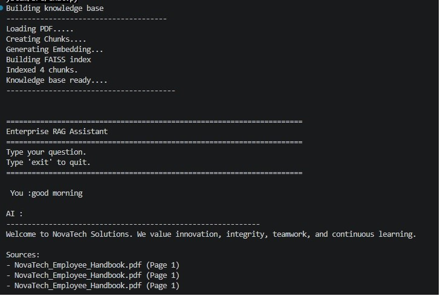
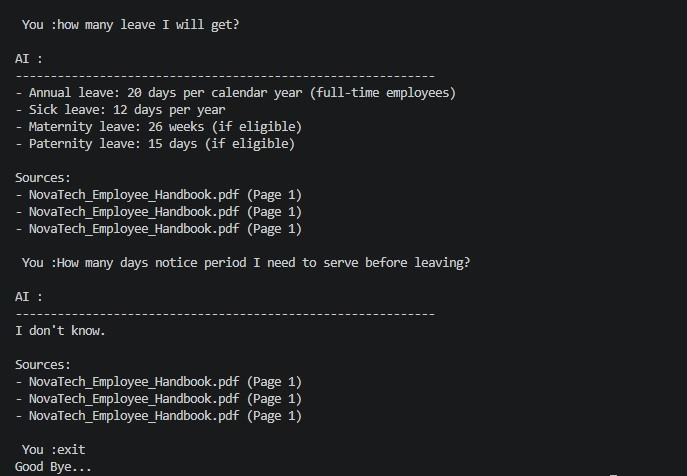

# 🚀 Enterprise RAG System

> **Build • Retrieve • Reason • Answer**

An Enterprise Retrieval-Augmented Generation (RAG) Assistant built completely from scratch using **Python, OpenAI, FAISS, and GPT**.

---

## 🌟 Project Overview

This project demonstrates how a modern Enterprise AI Assistant retrieves information from company documents using semantic search instead of relying solely on the Large Language Model's internal knowledge.

---

---

# 📷 Demo

## 🚀 Enterprise RAG Assistant Startup

The assistant loads the knowledge base, creates chunks, generates embeddings, and builds the FAISS index.

---

## 💬 Interactive Question Answering

The assistant answers questions using semantic search and GPT. When the requested information is unavailable, it responds with **"I don't know."** instead of hallucinating.

# ✨ Features

- 📄 PDF Document Loading
- ✂️ Intelligent Text Chunking
- 🧠 OpenAI Embedding Generation
- 📦 FAISS Vector Database
- 🔍 Semantic Search
- 🤖 GPT-Powered Answer Generation
- 💬 Interactive Chat Interface
- 🏗️ Modular Project Architecture
- 🔒 Environment Variable Support
- ⚡ Fast Vector Retrieval

This project was built to understand **RAG from first principles**, without using high-level frameworks like LangChain or LlamaIndex.
